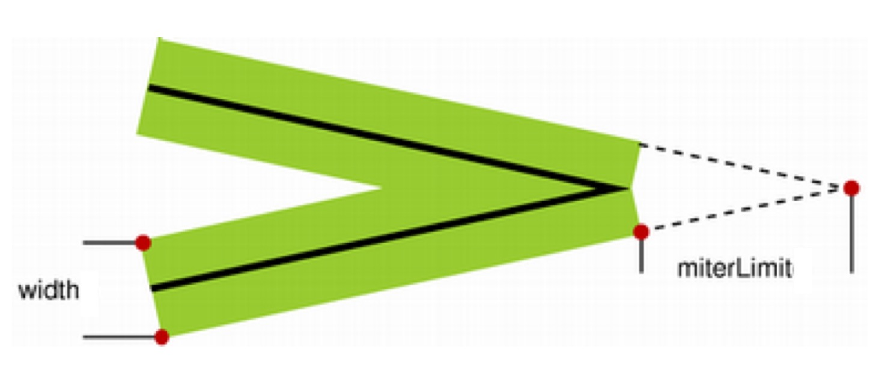

# Three

### 线条的属性

1. lineCap: 线条的帽子
  - butt：默认值，端点是垂直于线段边缘的平直边缘。
  - round：端点是在线段边缘处以线宽为直径的半圆。
  - square：端点是在选段边缘处以线宽为长、以一半线宽为宽的矩形。

2. lineJoin: 线条的链接
  - miter：默认值，在连接处边缘延长相接。miterLimit 是角长和线宽所允许的最大比例(默认是 10)。
    - miterLimit：miterLimit规定了一个自动填充连接点的极限值。如果超过了这个值，会导致lineJoin属性失效，会从 miter 变成 bevel。可以看出来，这个值和线宽以及夹角有关.
    
  - bevel：连接处是一个对角线斜角。
  - round：连接处是一个圆。

3. lineWidth: 线条的宽度

4. strokeStyle: 笔触样式